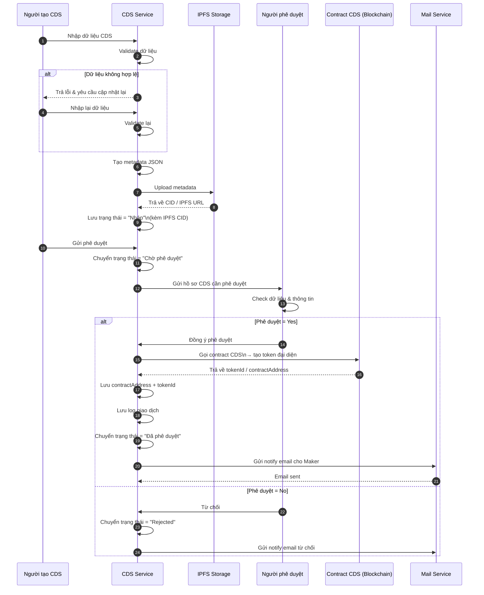

# 1. Luồng tạo CDS với phê duyệt

## Người tạo CDS

1. Nhập dữ liệu CDS để hệ thống kiểm tra tính hợp lệ.
2. Tạo metadata JSON từ dữ liệu đã nhập.
3. Upload metadata lên IPFS và nhận về CID.
4. Lưu bản ghi với trạng thái `Nháp`.
5. Gửi yêu cầu phê duyệt hồ sơ.

## Người phê duyệt

6. Kiểm tra lại toàn bộ thông tin hồ sơ.
7. Nếu phê duyệt:
   - Gọi contract để tạo token CDS.
   - Ghi lại `contractAddress` và `tokenId`.
   - Lưu log giao dịch.
   - Cập nhật trạng thái hồ sơ.
   - Gửi email thông báo đã phê duyệt.
8. Nếu từ chối: đổi trạng thái sang `Rejected` và gửi email thông báo từ chối.

## Sequence Diagram

