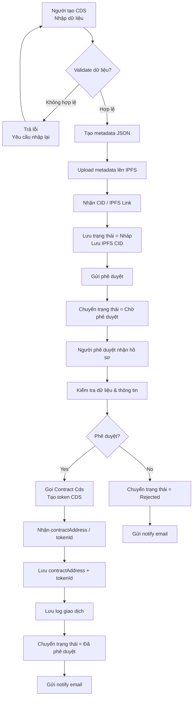
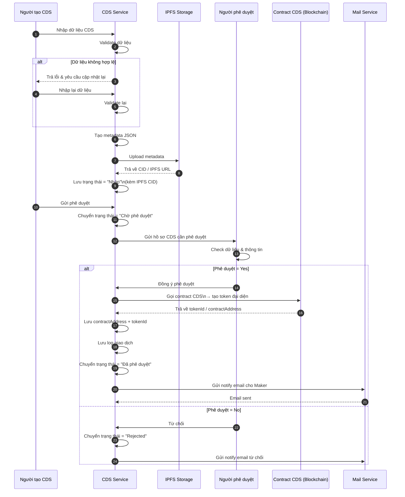

# 1. Luồng tạo CDS với phê duyệt

## Người tạo CDS

1. Nhập bộ dữ liệu CDS và để hệ thống tự động validate
2. Sinh metadata JSON từ dữ liệu hợp lệ
3. Upload metadata lên IPFS để lấy CID
4. Lưu bản ghi ở trạng thái `Nháp`, kèm CID
5. Thực hiện thao tác gửi yêu cầu phê duyệt

## Người phê duyệt

6. Rà soát lại toàn bộ dữ liệu và chứng từ đi kèm
7. Nếu đồng ý phê duyệt:
   - Gọi contract để đúc token CDS
   - Lưu lại `contractAddress` và `tokenId`
   - Ghi log giao dịch
   - Cập nhật trạng thái sang `Đã phê duyệt`
   - Gửi email thông báo kết quả
8. Nếu từ chối: cập nhật trạng thái `Rejected` và gửi email thông báo lý do

## Follow Diagram

## Sequence Diagram

