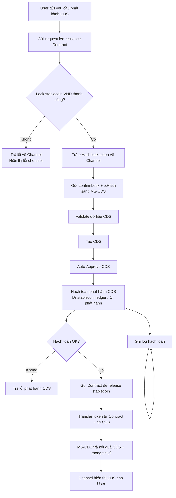
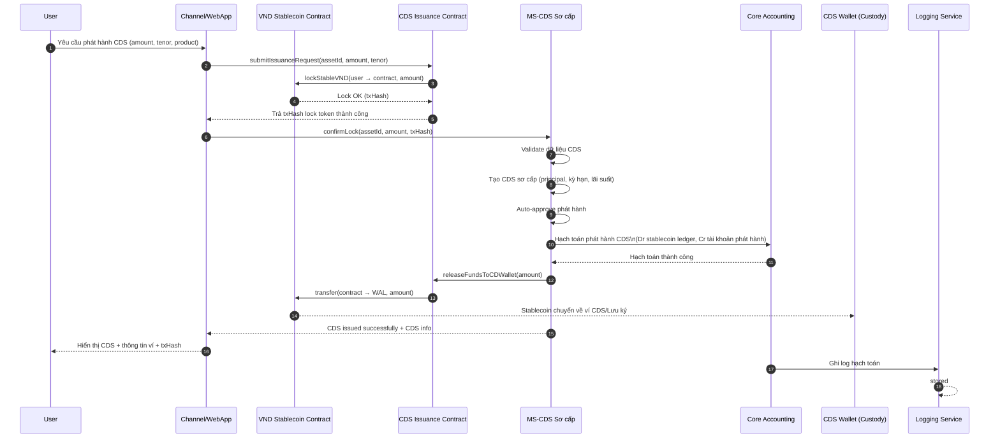

# 2. Luồng phát hành CDS qua Channel

## Các bước thực hiện

### 1. User gửi yêu cầu phát hành

User chọn:
- amount
- tenor (kỳ hạn)
- loại sản phẩm CDS

### 2. Contract lock stablecoin

Contract thực hiện lock số lượng stablecoin tương ứng từ user.

### 3. Channel gọi MS-CDS

Sau khi lock thành công:
- Channel gửi confirmLock + txHash vào MS-CDS

### 4. MS-CDS phát hành

MS-CDS thực hiện:
- Validate dữ liệu
- Tạo CDS
- Auto approve (do phát hành qua kênh)

### 5. Hạch toán Core Accounting

Core ledger ghi:
- Dr stablecoin pool
- Cr account phát hành CDS

**Lưu ý**: Nếu lỗi hạch toán → rollback nghiệp vụ (contract vẫn lock)

### 6. Chuyển stablecoin sang ví CDS

MS-CDS yêu cầu Issuance Contract trả stablecoin vào ví CDS/custodian wallet.

### 7. Trả kết quả cho User

User thấy:
- Thông tin CDS
- Ngày đáo hạn
- Lãi suất
- txHash lock
- txHash release
## Flowchart Diagram

## Sequence Diagram

