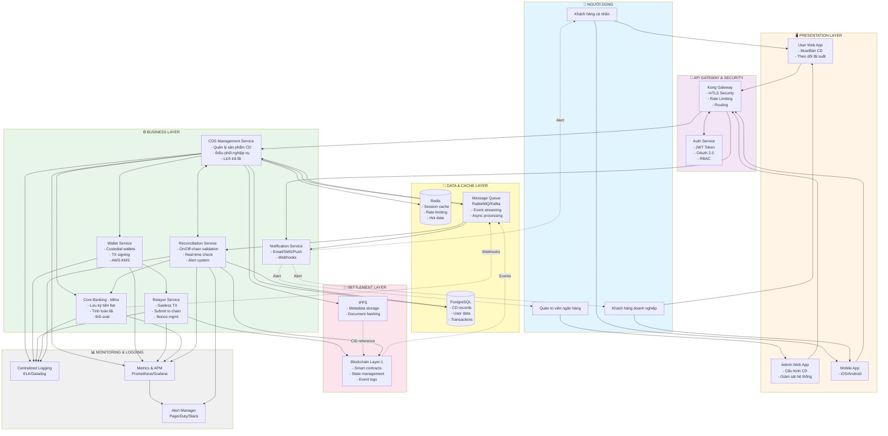
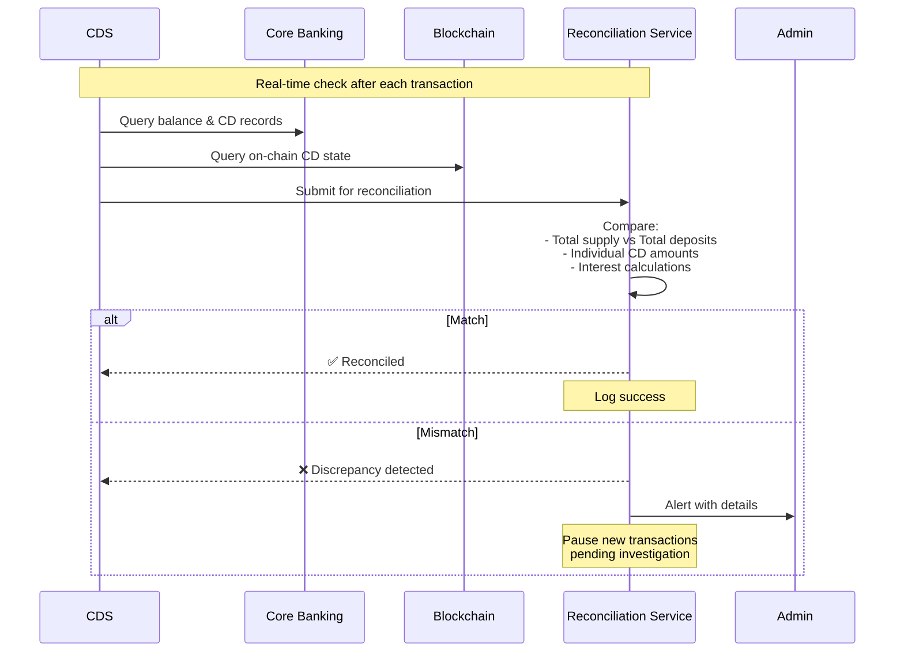
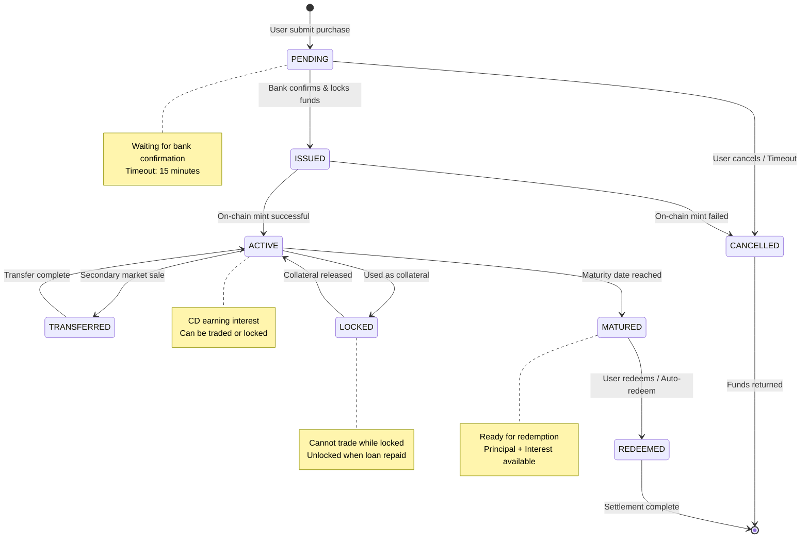

# Architecture and Technical Approach

## Kiến trúc Layer-1 cho Chứng chỉ Tiền gửi được Token hóa

---


## Tổng quan kiến trúc hệ thống

### Sơ đồ luồng tổng quan (Flowchart)



### Cấu trúc 3 tầng

Kiến trúc được chia tách rõ ràng thành ba lớp:

```
┌─────────────────────────────────────────────────────────────┐
│              1️⃣ PRESENTATION LAYER                          │
│        (Trải nghiệm người dùng)                             │
│                                                             │
│  ┌──────────────────┐        ┌──────────────────┐          │
│  │  User Web App    │        │  Admin Web App   │          │
│  └──────────────────┘        └──────────────────┘          │
└─────────────────────────────────────────────────────────────┘
                           │
                           ▼
┌─────────────────────────────────────────────────────────────┐
│              2️⃣ BUSINESS LAYER                              │
│        (Nghiệp vụ ngân hàng & điều phối)                    │
│                                                             │
│            ┌──────────────────────┐                         │
│            │   API Gateway (Kong) │                         │
│            └──────────────────────┘                         │
│                       │                                     │
│         ┌─────────────┼─────────────┐                       │
│         ▼             ▼             ▼                       │
│  ┌─────────────┐ ┌──────────┐ ┌─────────────┐             │
│  │    CDS      │ │  Wallet  │ │   Relayer   │             │
│  │ Management  │ │  Service │ │   Service   │             │
│  └─────────────┘ └──────────┘ └─────────────┘             │
│         │            │              │                       │
│         ▼            ▼              │                       │
│  ┌─────────────┐ ┌──────────┐     │                       │
│  │   Mifox     │ │ AWS KMS  │     │                       │
│  │ (Core Bank) │ │          │     │                       │
│  └─────────────┘ └──────────┘     │                       │
└─────────────────────────────────────────────────────────────┘
                           │
                           ▼
┌─────────────────────────────────────────────────────────────┐
│              3️⃣ SETTLEMENT LAYER                            │
│        (Settlement và lưu trữ on-chain)                     │
│                                                             │
│  ┌──────────────┐              ┌────────────────┐          │
│  │     IPFS     │              │  Blockchain    │          │
│  │  (Metadata)  │◄────────────►│   Layer-1      │          │
│  └──────────────┘              │ (State & Logic)│          │
│                                └────────────────┘          │
└─────────────────────────────────────────────────────────────┘
```

### Luồng hoạt động chính

#### 1. Presentation Layer

Người dùng và quản trị viên thao tác qua **User Web App**, **Mobile App** và **Admin Web App**, tất cả request đều đi qua **API Gateway** – điểm truy cập duy nhất.

**User Web App & Mobile App:**
- Đăng ký mua CD
- Theo dõi lãi suất
- Xem lịch trả lãi
- Kiểm tra trạng thái đáo hạn
- Nhận thông báo real-time

**Admin Web App:**
- Cấu hình sản phẩm CD
- Thiết lập kỳ hạn và lãi suất
- Giám sát hệ thống
- Quản lý quy tắc vận hành
- Xem dashboard reconciliation

#### 2. Business Layer

**API Gateway & Security:**
- Entry point duy nhất cho toàn hệ thống
- **Kong Gateway:** Routing, rate limiting, mTLS security
- **Auth Service:** JWT token management, OAuth 2.0, RBAC (Role-Based Access Control)
- Tích hợp với Identity Provider (IdP)

**CDS Management Service:**

Logic nghiệp vụ CD được xử lý tại **CDS Management Service**, tích hợp trực tiếp với **Core Banking Service (Mifox)**.

Chức năng:
- Quản lý sản phẩm CD và CD instances
- Thiết lập lịch trả lãi và đáo hạn
- Điều phối giữa Core Banking, IPFS và Blockchain
- Kích hoạt các hành động on-chain
- Lưu trữ state vào PostgreSQL
- Cache hot data vào Redis
- Publish events vào Message Queue

**Wallet Service + AWS KMS:**
- Custodial wallet management
- Transaction signing under policy control (AWS KMS/HSM)
- Keys never leave secure boundary
- Support EIP-712 typed data signing

**Relayer Service:**
- Chi trả phí giao dịch (gasless UX)
- Thu thập chữ ký và submit lên chain
- Theo dõi trạng thái và retry
- Nonce management để tránh transaction collision

**Core Banking (Mifox):**
- Nguồn dữ liệu tài chính gốc
- Ghi nhận tiền gửi bảo chứng
- Tính toán lãi suất và số tiền đáo hạn
- Xác nhận đối soát trước khi on-chain
- Webhook callbacks cho CDS qua Message Queue

**Reconciliation Service:**
- Real-time validation giữa on-chain và off-chain state
- So sánh total supply vs total deposits
- Kiểm tra interest calculations
- Tự động alert khi phát hiện discrepancy
- Pause transactions khi có mismatch

**Notification Service:**
- Email, SMS, Push notification
- Webhook callbacks cho third-party integrations
- Template management
- Retry mechanism

#### 3. Settlement Layer (Tầng thanh toán)

**IPFS (Off-chain Metadata):**

- Metadata CD được lưu off-chain trên **IPFS**:
  - Mệnh giá
  - Lãi suất
  - Kỳ hạn
  - Đơn vị phát hành
  - Hash tài liệu pháp lý

**Blockchain Layer-1 (On-chain State):**

- Trạng thái, vòng đời và logic bất biến được lưu on-chain trên **Layer-1**:
  - Smart contract quản lý CD
  - Vòng đời CD (ISSUED → ACTIVE → MATURED → REDEEMED)
  - Tham chiếu metadata IPFS (CID/hash)
  - Event log phục vụ audit

### Luồng giao dịch end-to-end (Cập nhật)

```
User Action → Web/Mobile App → Kong Gateway → Auth Service → CDS Management
                                                                    ↓
                                                    ┌───────────────┼────────────┐
                                                    ▼               ▼            ▼
                                               Core Banking      IPFS      Wallet Service
                                               (Verify $)    (Store data)   (Sign TX)
                                                    │               │            │
                                                    └───────────────┼────────────┘
                                                                    ▼
                                                              Relayer Service
                                                              (Pay gas & submit)
                                                                    │
                                                                    ▼
                                                            Blockchain Layer-1
                                                            (Finalize & emit events)
                                                                    │
                                                                    ▼
                                                            Message Queue (MQ)
                                            ┌───────────────────────┼──────────────────┐
                                            ▼                       ▼                  ▼
                                    CDS Management          Reconciliation     Notification
                                    (Update state)          (Validate state)   (Alert users)
                                            │                       │
                                            └───────────┬───────────┘
                                                        ▼
                                                   PostgreSQL
                                                   (Persist)
```

### Điểm nổi bật

Giao dịch on-chain được:

- ✅ Ký an toàn thông qua **Wallet Service** sử dụng AWS KMS (custodial),
- ✅ **Relayer Service** chi trả phí giao dịch, giúp người dùng có trải nghiệm gasless,
- ✅ Đảm bảo bảo chứng 1:1 giữa token CD và tiền gửi thực tế trong Core Banking,
- ✅ Minh bạch, có thể audit thông qua event log on-chain,
- ✅ **Reconciliation Service** đảm bảo tính nhất quán real-time,
- ✅ **Event-driven architecture** qua Message Queue cho scalability,
- ✅ **Multi-channel notifications** cho user experience tốt hơn,
- ✅ **Observability đầy đủ** với logging, metrics và alerting.

---

## Cải tiến so với phiên bản trước

### 🆕 Thành phần bổ sung:

1. **Auth Service** - Tách riêng authentication/authorization khỏi Kong Gateway
2. **Data Layer** - PostgreSQL + Redis + Message Queue cho persistence và caching
3. **Reconciliation Service** - Đảm bảo consistency giữa on-chain và off-chain
4. **Notification Service** - Multi-channel communication với users
5. **Observability Layer** - Centralized logging, metrics, và alerting
6. **Mobile App** - Mở rộng presentation layer cho mobile users

### 🔄 Cải thiện luồng:

**Trước:**
```
User → Kong → CDS → (Mifox/IPFS/Wallet) → Relayer → L1
```

**Sau:**
```
User → Kong → Auth → CDS → (Mifox/IPFS/Wallet) → Relayer → L1
                                    ↓                              ↓
                               PostgreSQL ← MQ ← (Events) ← Blockchain
                                              ↓
                                    Reconciliation + Notification
```

### 🎯 Lợi ích:

- **Scalability**: Event-driven architecture cho phép horizontal scaling
- **Reliability**: Reconciliation service phát hiện và alert discrepancies
- **Observability**: Full visibility vào system behavior
- **User Experience**: Real-time notifications qua multiple channels
- **Security**: RBAC và OAuth 2.0 cho fine-grained access control
- **Performance**: Redis caching giảm load lên database và blockchain RPC

---

## Các thành phần chính

### 1️⃣ API Gateway (Kong)

- Entrypoint duy nhất cho toàn hệ thống,
- Định tuyến request đến các service nội bộ,
- Áp dụng mTLS, rate-limit, xác thực và logging,
- Đáp ứng tiêu chuẩn bảo mật cấp doanh nghiệp.

---

### 2️⃣ User Web App & Admin Web App

- **User Web App**: đăng ký mua CD, theo dõi lãi suất, lịch trả lãi và trạng thái đáo hạn.
- **Admin Web App**: cấu hình sản phẩm CD, kỳ hạn, lãi suất, quy tắc vận hành và giám sát hệ thống.

Người dùng không cần hiểu blockchain để sử dụng hệ thống.

---

### 3️⃣ CDS Management Service (Lớp nghiệp vụ trung tâm)

Đây là bộ não điều phối của hệ thống:

- Quản lý sản phẩm CD và từng CD instance,
- Thiết lập lịch trả lãi và đáo hạn,
- Điều phối giữa Core Banking, IPFS và Blockchain,
- Kích hoạt các hành động on-chain thông qua Relayer.

Mọi giao dịch on-chain đều phải phản ánh trạng thái tài chính hợp lệ off-chain.

---

### 4️⃣ Core Banking Integration – Mifox Service

Mifox đóng vai trò nguồn dữ liệu tài chính gốc:

- Ghi nhận tiền gửi bảo chứng cho mỗi CD,
- Tính toán lãi suất và số tiền đáo hạn,
- Xác nhận đối soát trước khi phát hành hoặc tất toán on-chain.

Đảm bảo bảo chứng 1:1 giữa token CD và tiền gửi thực.

#### Quy trình Reconciliation (Đối soát)

**Mục tiêu:** Đảm bảo tính nhất quán giữa on-chain state và off-chain banking records.

**1. Real-time Reconciliation (Mỗi giao dịch):**




### 5️⃣ Off-chain Metadata – IPFS

Các thông tin như:

- mệnh giá,
- lãi suất,
- kỳ hạn,
- đơn vị phát hành,
- hash tài liệu pháp lý,

được lưu trữ trên **IPFS**.

Blockchain chỉ lưu CID/hash tham chiếu, đảm bảo dữ liệu bất biến, dễ kiểm toán và tối ưu chi phí on-chain.


### 6️⃣ User Wallet Service – AWS KMS

- Private key được quản lý tập trung và bảo mật bằng **AWS KMS**,
- Không bao giờ lộ ra ngoài hệ thống,
- Ký giao dịch theo chuẩn EIP-712 hoặc raw transaction,
- Phù hợp với tiêu chuẩn bảo mật của tổ chức tài chính.

---

### 7️⃣ Relayer Service – Gasless Transaction

Relayer:

- Chi trả phí giao dịch on-chain,
- Thu thập chữ ký từ Wallet Service,
- Gửi giao dịch lên Layer-1,
- Theo dõi trạng thái và retry khi cần.

Người dùng có trải nghiệm tương đương ứng dụng tài chính truyền thống.

---

### 8️⃣ Blockchain Layer-1

Layer-1 lưu trữ:

- Smart contract quản lý CD,
- Vòng đời CD (state machine - xem chi tiết bên dưới),
- Tham chiếu metadata IPFS,
- Event log phục vụ audit và giám sát.

Blockchain đóng vai trò lớp settlement và kiểm toán minh bạch, không thay thế hệ thống ngân hàng.

---

### 9️⃣ Data & Cache Layer

**PostgreSQL Database:**
- Primary data store cho CD records, user profiles, transactions
- ACID compliance cho financial data integrity
- Indexes được tối ưu cho query performance
- Backup & replication cho high availability

**Redis Cache:**
- Session management và user authentication state
- Rate limiting counters
- Hot data caching (active CD list, interest rates)
- Pub/Sub cho real-time notifications
- TTL-based expiry cho temporary data

**Message Queue (RabbitMQ/Kafka):**
- Event streaming giữa các services
- Async processing cho non-critical tasks
- Dead letter queue cho failed messages
- Event replay capability cho debugging
- Decoupling giữa event producers và consumers

---

### 🔟 Reconciliation Service

Đây là thành phần quan trọng đảm bảo tính nhất quán dữ liệu:

**Chức năng chính:**
- Real-time validation mỗi khi có transaction on-chain
- Periodic batch reconciliation (hourly/daily)
- So sánh:
  - Total CD supply on-chain vs Total deposits off-chain
  - Individual CD balance vs Bank records
  - Interest calculations
  - State transitions (PENDING → ISSUED → ACTIVE → MATURED)

**Alert Mechanism:**
- Automatic alerts qua Slack/PagerDuty khi phát hiện discrepancy
- Pause new transactions cho đến khi resolve
- Audit trail đầy đủ cho investigation
- Dashboard cho admin monitoring

**Integration Points:**
- Query Blockchain RPC cho on-chain state
- Query Mifox API cho banking records
- Write reconciliation results vào PostgreSQL
- Publish alerts vào Notification Service

---

### 1️⃣1️⃣ Notification Service

**Multi-channel Support:**
- Email (transactional emails cho CD events)
- SMS (OTP, urgent alerts)
- Push notifications (mobile app)
- Webhooks (third-party integrations)

**Event Types:**
- CD purchase confirmation
- Interest payment notifications
- Maturity reminders
- Reconciliation alerts (admin only)
- System status updates

**Features:**
- Template management với dynamic variables
- Retry mechanism với exponential backoff
- Delivery status tracking
- User preference management (opt-in/opt-out)

---

### 1️⃣2️⃣ Observability & Monitoring

**Centralized Logging (ELK/Datadog):**
- Aggregate logs từ tất cả services
- Structured logging với correlation IDs
- Full-text search capability
- Log retention policies

**Metrics & APM (Prometheus/Grafana):**
- Service health metrics (CPU, memory, latency)
- Business metrics (CD issued, total volume, active users)
- Transaction success/failure rates
- Blockchain RPC call latencies
- Database query performance

**Alert Manager:**
- Threshold-based alerts
- Anomaly detection
- On-call rotation integration (PagerDuty)
- Escalation policies
- Incident management workflow

#### Vòng đời CD (State Machine)



**Các trạng thái:**

- **PENDING**: Đơn hàng mới, chờ xác nhận từ Core Banking
- **ISSUED**: Bank đã khóa tiền, chờ mint on-chain
- **ACTIVE**: CD đang hoạt động, tích lũy lãi suất
- **TRANSFERRED**: Đang trong quá trình chuyển nhượng trên secondary market
- **LOCKED**: Đang được sử dụng làm collateral (DeFi)
- **MATURED**: Đã đáo hạn, sẵn sàng tất toán
- **REDEEMED**: Đã tất toán, hoàn tất vòng đời
- **CANCELLED**: Đã hủy (timeout hoặc lỗi)

**Chuyển trạng thái:**


---

## Bảo mật & Tuân thủ

- Validator được kiểm soát (permissioned),
- Smart contract có thể audit,
- Event on-chain phục vụ giám sát và thanh tra,
- Phân tách rõ ràng giữa custody – nghiệp vụ – settlement.

---

## Giá trị cốt lõi của kiến trúc

- Thiết kế riêng cho tài sản tài chính có quản lý
- Thân thiện với ngân hàng và cơ quan quản lý
- Trải nghiệm người dùng đơn giản, không cần gas
-  Phân tách on-chain / off-chain rõ ràng

---

## Tổng kết

Chúng tôi xây dựng một Layer-1 ưu tiên tuân thủ, cho phép token hóa chứng chỉ tiền gửi trong khi ngân hàng vẫn kiểm soát dòng tiền, người dùng không cần trả gas và toàn bộ vòng đời được kiểm toán minh bạch trên blockchain.
