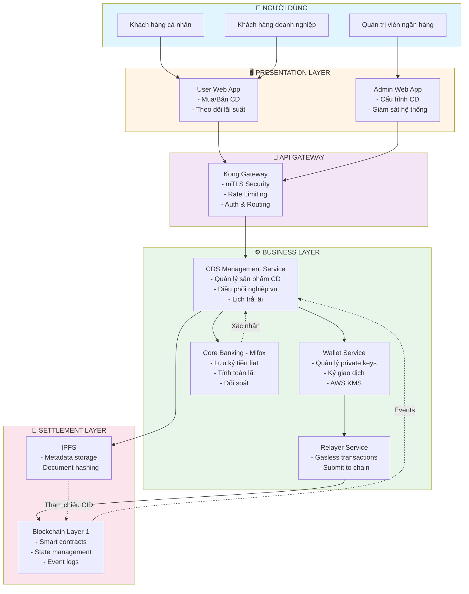
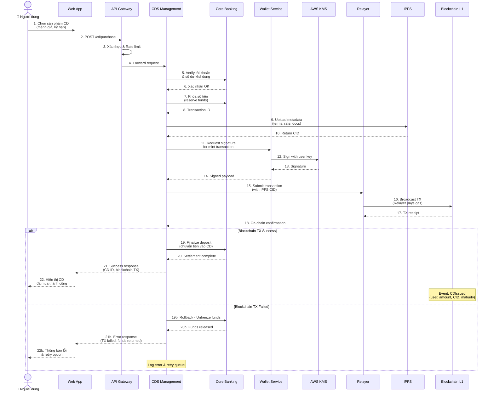
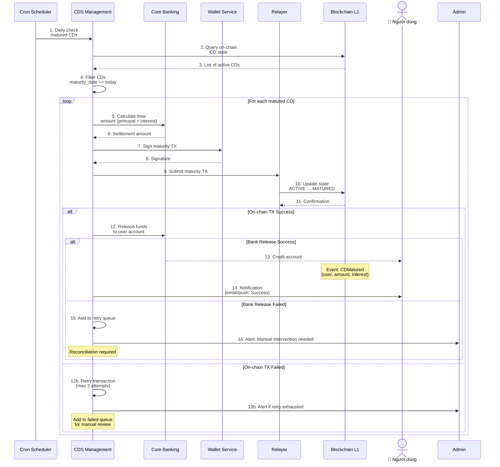
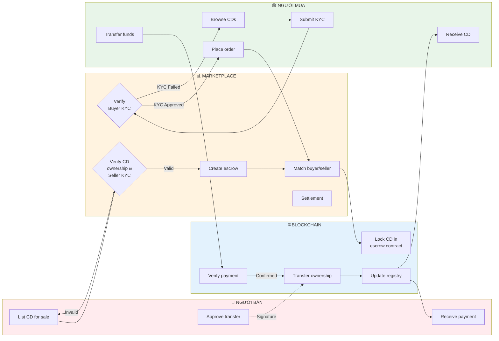
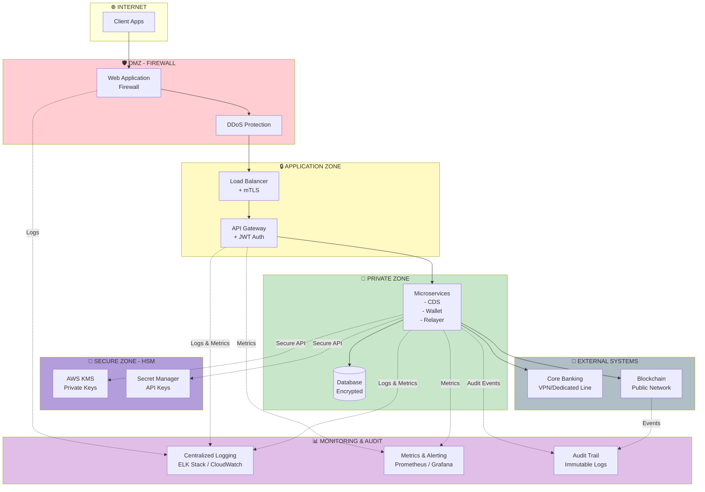
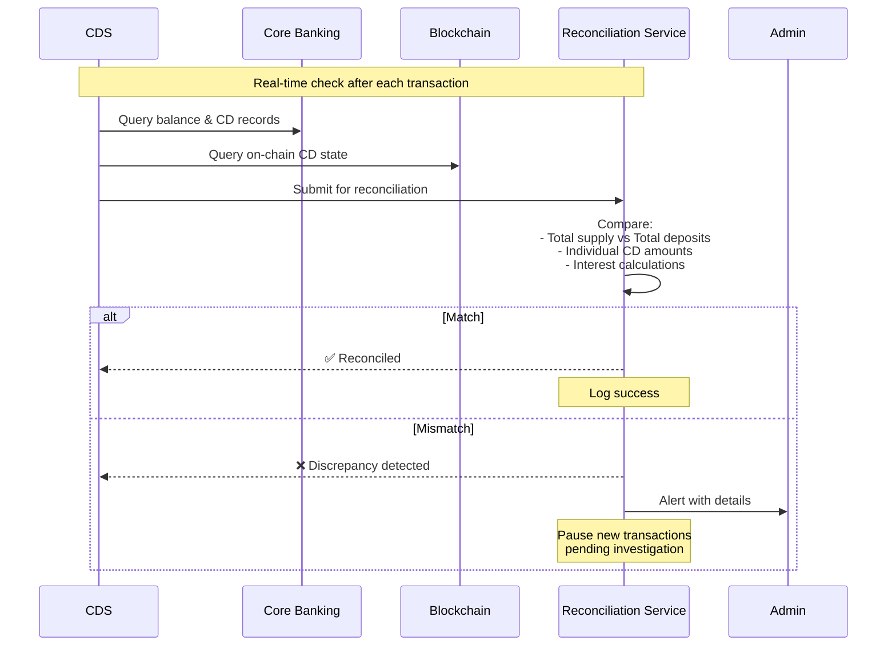
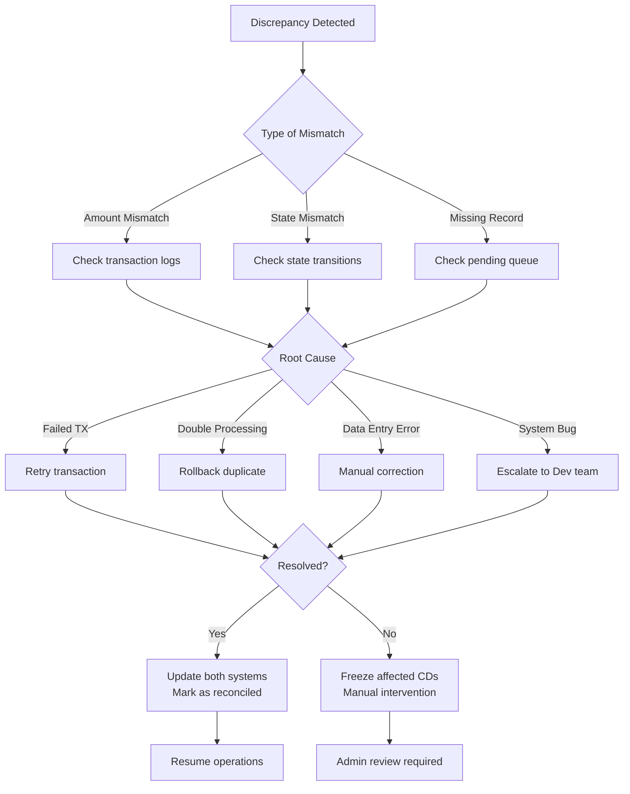
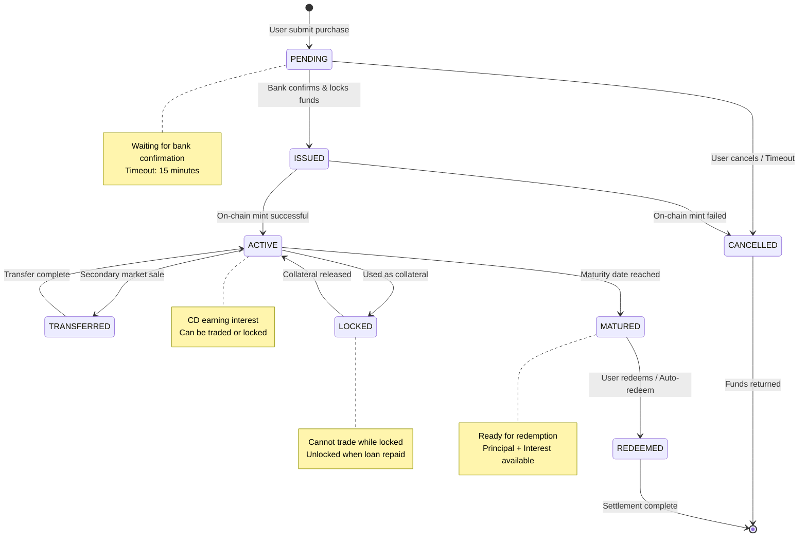

# Architecture and Technical Approach

## Kiến trúc Layer-1 cho Chứng chỉ Tiền gửi được Token hóa – Thiết kế ưu tiên tuân thủ

---

## Vấn đề chúng tôi giải quyết

Chứng chỉ tiền gửi (Certificate of Deposit – CD) là sản phẩm tài chính an toàn và phổ biến trong hệ thống ngân hàng, tuy nhiên vẫn tồn tại nhiều hạn chế:

- Thanh khoản thấp, gần như không có thị trường thứ cấp,
- Quy trình phát hành, quản lý và tất toán còn thủ công,
- Khó tích hợp vào hệ sinh thái tài chính số (treasury, collateral, DeFi có kiểm soát).

Giải pháp của chúng tôi là xây dựng một **Layer-1 blockchain chuyên biệt** cho tài sản tài chính có quản lý, trong đó CD được:

- token hóa,
- quản lý vòng đời đầy đủ,
- và vận hành minh bạch, có thể kiểm toán,

trong khi ngân hàng vẫn giữ vai trò trung tâm về lưu ký và đối soát tiền.

---

## Triết lý thiết kế: Compliance-first

Chứng chỉ tiền gửi là financial instrument có ràng buộc pháp lý, vì vậy kiến trúc hệ thống được xây dựng theo nguyên tắc:

**Tuân thủ trước – công nghệ sau**

Hệ thống:

- không thay thế ngân hàng,
- mà kết nối core banking truyền thống với một Layer-1 blockchain chuyên biệt.

Trong mô hình này:

- Ngân hàng chịu trách nhiệm lưu ký tiền fiat và tính toán lãi,
- Blockchain đóng vai trò lớp settlement, tự động hóa và kiểm toán minh bạch.

---

## Vì sao cần Layer-1 riêng (Application-Specific L1)?

Việc triển khai CD chỉ bằng smart contract trên public chain không đáp ứng được các yêu cầu sau:

- Kiểm soát validator và participant,
- Tuân thủ KYC/AML và chính sách nội bộ,
- Phí giao dịch ổn định, hiệu năng cao,
- Tích hợp chặt chẽ với core banking.

Do đó, chúng tôi lựa chọn **Application-Specific Layer-1**, được thiết kế riêng cho tài sản tài chính có quản lý, thay vì chỉ triển khai smart contract trên public blockchain.

---

## Tổng quan kiến trúc hệ thống

### Sơ đồ luồng tổng quan (Flowchart)



### Luồng giao dịch chi tiết - Use Case: Mua CD



### Luồng đáo hạn CD



### Luồng chuyển nhượng CD (Secondary Market)



### Kiến trúc bảo mật đa lớp



### Cấu trúc 3 tầng

Kiến trúc được chia tách rõ ràng thành ba lớp:

```
┌─────────────────────────────────────────────────────────────┐
│              1️⃣ PRESENTATION LAYER                          │
│        (Trải nghiệm người dùng)                             │
│                                                             │
│  ┌──────────────────┐        ┌──────────────────┐          │
│  │  User Web App    │        │  Admin Web App   │          │
│  └──────────────────┘        └──────────────────┘          │
└─────────────────────────────────────────────────────────────┘
                           │
                           ▼
┌─────────────────────────────────────────────────────────────┐
│              2️⃣ BUSINESS LAYER                              │
│        (Nghiệp vụ ngân hàng & điều phối)                    │
│                                                             │
│            ┌──────────────────────┐                         │
│            │   API Gateway (Kong) │                         │
│            └──────────────────────┘                         │
│                       │                                     │
│         ┌─────────────┼─────────────┐                       │
│         ▼             ▼             ▼                       │
│  ┌─────────────┐ ┌──────────┐ ┌─────────────┐             │
│  │    CDS      │ │  Wallet  │ │   Relayer   │             │
│  │ Management  │ │  Service │ │   Service   │             │
│  └─────────────┘ └──────────┘ └─────────────┘             │
│         │            │              │                       │
│         ▼            ▼              │                       │
│  ┌─────────────┐ ┌──────────┐     │                       │
│  │   Mifox     │ │ AWS KMS  │     │                       │
│  │ (Core Bank) │ │          │     │                       │
│  └─────────────┘ └──────────┘     │                       │
└─────────────────────────────────────────────────────────────┘
                           │
                           ▼
┌─────────────────────────────────────────────────────────────┐
│              3️⃣ SETTLEMENT LAYER                            │
│        (Settlement và lưu trữ on-chain)                     │
│                                                             │
│  ┌──────────────┐              ┌────────────────┐          │
│  │     IPFS     │              │  Blockchain    │          │
│  │  (Metadata)  │◄────────────►│   Layer-1      │          │
│  └──────────────┘              │ (State & Logic)│          │
│                                └────────────────┘          │
└─────────────────────────────────────────────────────────────┘
```

### Luồng hoạt động chính

#### 1. Presentation Layer (Tầng trình bày)

Người dùng và quản trị viên thao tác qua **User Web App** và **Admin Web App**, tất cả request đều đi qua **API Gateway (Kong)** – điểm truy cập duy nhất.

**User Web App:**
- Đăng ký mua CD
- Theo dõi lãi suất
- Xem lịch trả lãi
- Kiểm tra trạng thái đáo hạn

**Admin Web App:**
- Cấu hình sản phẩm CD
- Thiết lập kỳ hạn và lãi suất
- Giám sát hệ thống
- Quản lý quy tắc vận hành

#### 2. Business Layer (Tầng nghiệp vụ)

**API Gateway (Kong):**
- Entry point duy nhất cho toàn hệ thống
- Routing, authentication, rate limiting
- mTLS security, logging & monitoring

**CDS Management Service:**

Logic nghiệp vụ CD được xử lý tại **CDS Management Service**, tích hợp trực tiếp với **Core Banking Service (Mifox)**.

Chức năng:
- Quản lý sản phẩm CD và CD instances
- Thiết lập lịch trả lãi và đáo hạn
- Điều phối giữa Core Banking, IPFS và Blockchain
- Kích hoạt các hành động on-chain

**Wallet Service + AWS KMS:**
- Quản lý private keys an toàn
- Ký giao dịch theo chuẩn EIP-712
- Không lộ key ra ngoài hệ thống

**Relayer Service:**
- Chi trả phí giao dịch (gasless UX)
- Thu thập chữ ký và submit lên chain
- Theo dõi trạng thái và retry

**Core Banking (Mifox):**
- Nguồn dữ liệu tài chính gốc
- Ghi nhận tiền gửi bảo chứng
- Tính toán lãi suất và số tiền đáo hạn
- Xác nhận đối soát trước khi on-chain

#### 3. Settlement Layer (Tầng thanh toán)

**IPFS (Off-chain Metadata):**

- Metadata CD được lưu off-chain trên **IPFS**:
  - Mệnh giá
  - Lãi suất
  - Kỳ hạn
  - Đơn vị phát hành
  - Hash tài liệu pháp lý

**Blockchain Layer-1 (On-chain State):**

- Trạng thái, vòng đời và logic bất biến được lưu on-chain trên **Layer-1**:
  - Smart contract quản lý CD
  - Vòng đời CD (ISSUED → ACTIVE → MATURED → REDEEMED)
  - Tham chiếu metadata IPFS (CID/hash)
  - Event log phục vụ audit

### Luồng giao dịch end-to-end

```
User Action → Web App → API Gateway → CDS Management
                                            ↓
                              ┌─────────────┼─────────────┐
                              ▼             ▼             ▼
                         Core Banking    IPFS        Wallet Service
                         (Verify $)    (Store data)   (Sign TX)
                              │             │             │
                              └─────────────┼─────────────┘
                                            ▼
                                      Relayer Service
                                      (Pay gas & submit)
                                            │
                                            ▼
                                    Blockchain Layer-1
                                    (Finalize & emit events)
```

### Điểm nổi bật

Giao dịch on-chain được:

- ✅ Ký an toàn thông qua **User Wallet Service** sử dụng AWS KMS,
- ✅ **Relayer Service** chi trả phí giao dịch, giúp người dùng có trải nghiệm gasless,
- ✅ Đảm bảo bảo chứng 1:1 giữa token CD và tiền gửi thực tế trong Core Banking,
- ✅ Minh bạch, có thể audit thông qua event log on-chain.

---

## Các thành phần chính

### 1️⃣ API Gateway (Kong)

- Entrypoint duy nhất cho toàn hệ thống,
- Định tuyến request đến các service nội bộ,
- Áp dụng mTLS, rate-limit, xác thực và logging,
- Đáp ứng tiêu chuẩn bảo mật cấp doanh nghiệp.

---

### 2️⃣ User Web App & Admin Web App

- **User Web App**: đăng ký mua CD, theo dõi lãi suất, lịch trả lãi và trạng thái đáo hạn.
- **Admin Web App**: cấu hình sản phẩm CD, kỳ hạn, lãi suất, quy tắc vận hành và giám sát hệ thống.

Người dùng không cần hiểu blockchain để sử dụng hệ thống.

---

### 3️⃣ CDS Management Service (Lớp nghiệp vụ trung tâm)

Đây là bộ não điều phối của hệ thống:

- Quản lý sản phẩm CD và từng CD instance,
- Thiết lập lịch trả lãi và đáo hạn,
- Điều phối giữa Core Banking, IPFS và Blockchain,
- Kích hoạt các hành động on-chain thông qua Relayer.

Mọi giao dịch on-chain đều phải phản ánh trạng thái tài chính hợp lệ off-chain.

---

### 4️⃣ Core Banking Integration – Mifox Service

Mifox đóng vai trò nguồn dữ liệu tài chính gốc:

- Ghi nhận tiền gửi bảo chứng cho mỗi CD,
- Tính toán lãi suất và số tiền đáo hạn,
- Xác nhận đối soát trước khi phát hành hoặc tất toán on-chain.

Đảm bảo bảo chứng 1:1 giữa token CD và tiền gửi thực.

#### Quy trình Reconciliation (Đối soát)

**Mục tiêu:** Đảm bảo tính nhất quán giữa on-chain state và off-chain banking records.

**1. Real-time Reconciliation (Mỗi giao dịch):**



**2. Scheduled Reconciliation:**

| Tần suất | Scope | Action |
|---------|-------|--------|
| **Hourly** | Active CDs | Verify state consistency |
| **Daily** | Full portfolio | Complete balance check |
| **Weekly** | Interest accrual | Verify interest calculations |
| **Monthly** | Audit report | Generate compliance report |

**3. Reconciliation Checks:**

```
┌─────────────────────────────────────────────────────┐
│         RECONCILIATION CHECKPOINTS                  │
├─────────────────────────────────────────────────────┤
│                                                     │
│  ✓ Total Supply Check                              │
│    ON-CHAIN: Σ(CD tokens minted)                   │
│    OFF-CHAIN: Σ(Deposits in Mifox)                 │
│    MUST MATCH: 1:1 ratio                           │
│                                                     │
│  ✓ Individual CD Verification                      │
│    For each CD ID:                                 │
│    - Principal amount matches                      │
│    - Maturity date matches                         │
│    - Interest rate matches                         │
│    - Owner address matches account                 │
│                                                     │
│  ✓ State Consistency                               │
│    CD state on-chain = CD status in bank           │
│    (ACTIVE/MATURED/REDEEMED)                       │
│                                                     │
│  ✓ Interest Calculation                            │
│    Bank-calculated interest = Smart contract calc  │
│    Tolerance: ± 0.01% (rounding differences)       │
│                                                     │
│  ✓ Transaction History                             │
│    All on-chain events have corresponding          │
│    bank transactions (and vice versa)              │
│                                                     │
└─────────────────────────────────────────────────────┘
```

**4. Discrepancy Resolution Process:**



**5. Automated Alerts:**

```yaml
Alert Levels:
  WARNING:
    - Minor discrepancy (< 0.01%)
    - Delayed reconciliation (> 1 hour)
    - Single CD mismatch
    Action: Log, auto-retry

  ERROR:
    - Significant mismatch (> 0.1%)
    - Multiple CD mismatches
    - Failed retry (3 attempts)
    Action: Notify DevOps, pause new CDs

  CRITICAL:
    - Total supply mismatch (> 1%)
    - System-wide discrepancy
    - Security breach suspected
    Action: Freeze all operations, notify C-level
```

**6. Audit Trail:**

Tất cả reconciliation events được lưu vào:
- **Database**: Structured logs với timestamp, before/after state
- **Blockchain**: Hash của reconciliation report (immutable proof)
- **S3**: Full reconciliation reports (regulatory compliance)

**7. Monthly Audit Report:**

```
Generated automatically on 1st of each month:

📊 Reconciliation Summary Report
├─ Total CDs issued: X
├─ Total value locked: $Y
├─ Successful reconciliations: Z%
├─ Discrepancies detected: N
│  ├─ Auto-resolved: M
│  └─ Manual intervention: (N-M)
├─ Average reconciliation time: T seconds
└─ Compliance status: ✅ PASS / ❌ FAIL

Submitted to:
- Internal Audit team
- Compliance officer
- External auditor (if required)
```

**Lợi ích:**

- ✅ **Real-time detection** của discrepancies
- ✅ **Automated resolution** cho 95% cases
- ✅ **Audit-ready** reports
- ✅ **Regulatory compliance** (Basel III, SOX)
- ✅ **Transparent trail** for investigations

---

### 5️⃣ Off-chain Metadata – IPFS

Các thông tin như:

- mệnh giá,
- lãi suất,
- kỳ hạn,
- đơn vị phát hành,
- hash tài liệu pháp lý,

được lưu trữ trên **IPFS**.

Blockchain chỉ lưu CID/hash tham chiếu, đảm bảo dữ liệu bất biến, dễ kiểm toán và tối ưu chi phí on-chain.

#### Chiến lược Pinning & High Availability

**1. Multi-tier Pinning Strategy:**

```
┌─────────────────────────────────────────────────────┐
│           IPFS STORAGE ARCHITECTURE                 │
├─────────────────────────────────────────────────────┤
│                                                     │
│  Tier 1: Local IPFS Nodes (Hot Storage)            │
│  ├─ Primary Node (Data Center A)                   │
│  ├─ Replica Node (Data Center B)                   │
│  └─ Replica Node (Data Center C)                   │
│                                                     │
│  Tier 2: Pinning Services (Managed)                │
│  ├─ Pinata (Primary pinning service)               │
│  ├─ Web3.Storage (Backup service)                  │
│  └─ Filebase (S3-compatible backup)                │
│                                                     │
│  Tier 3: Archive Storage (Cold Storage)            │
│  ├─ AWS S3 Glacier (Long-term archive)             │
│  └─ Filecoin (Decentralized archive)               │
│                                                     │
└─────────────────────────────────────────────────────┘
```

**2. Replication & Redundancy:**

- **Minimum 5 copies** của mỗi CID:
  - 3 copies trên local IPFS nodes (different regions)
  - 2 copies trên pinning services
- **Geographic distribution**: Nodes ở 3 châu lục khác nhau
- **Auto-replication**: Nếu node offline, tự động pin lên node khác

**3. Backup & Recovery:**

```
Daily:  Snapshot metadata → S3
Weekly: Full backup → Glacier
Monthly: Archive → Filecoin

Recovery Time Objective (RTO): < 1 hour
Recovery Point Objective (RPO): < 24 hours
```

**4. Monitoring & Alerting:**

- **Health checks** (mỗi 5 phút): Verify CID accessibility
- **Alert triggers**:
  - CID không accessible từ > 2 nodes
  - Pin count < 3
  - Gateway response time > 2s
- **Auto-healing**: Tự động re-pin nếu detect missing

**5. Gateway Strategy:**

```
User Request → CDN (CloudFlare)
              ↓
    ┌─────────┴─────────┐
    ▼                   ▼
IPFS Gateway 1    IPFS Gateway 2
(Primary)         (Failover)
    │                   │
    └─────────┬─────────┘
              ▼
        IPFS Network
```

**Lợi ích:**

- ✅ **High Availability**: 99.99% uptime
- ✅ **Disaster Recovery**: Multi-region, multi-provider
- ✅ **Cost Optimization**: Hot/Cold tiering
- ✅ **Compliance**: Immutable audit trail
- ✅ **Performance**: CDN caching cho metadata access

---

### 6️⃣ User Wallet Service – AWS KMS

- Private key được quản lý tập trung và bảo mật bằng **AWS KMS**,
- Không bao giờ lộ ra ngoài hệ thống,
- Ký giao dịch theo chuẩn EIP-712 hoặc raw transaction,
- Phù hợp với tiêu chuẩn bảo mật của tổ chức tài chính.

---

### 7️⃣ Relayer Service – Gasless Transaction

Relayer:

- Chi trả phí giao dịch on-chain,
- Thu thập chữ ký từ Wallet Service,
- Gửi giao dịch lên Layer-1,
- Theo dõi trạng thái và retry khi cần.

Người dùng có trải nghiệm tương đương ứng dụng tài chính truyền thống.

---

### 8️⃣ Blockchain Layer-1

Layer-1 lưu trữ:

- Smart contract quản lý CD,
- Vòng đời CD (state machine - xem chi tiết bên dưới),
- Tham chiếu metadata IPFS,
- Event log phục vụ audit và giám sát.

Blockchain đóng vai trò lớp settlement và kiểm toán minh bạch, không thay thế hệ thống ngân hàng.

#### Vòng đời CD (State Machine)



**Các trạng thái:**

- **PENDING**: Đơn hàng mới, chờ xác nhận từ Core Banking
- **ISSUED**: Bank đã khóa tiền, chờ mint on-chain
- **ACTIVE**: CD đang hoạt động, tích lũy lãi suất
- **TRANSFERRED**: Đang trong quá trình chuyển nhượng trên secondary market
- **LOCKED**: Đang được sử dụng làm collateral (DeFi)
- **MATURED**: Đã đáo hạn, sẵn sàng tất toán
- **REDEEMED**: Đã tất toán, hoàn tất vòng đời
- **CANCELLED**: Đã hủy (timeout hoặc lỗi)

**Chuyển trạng thái:**

| Từ | Đến | Trigger | Condition |
|---|---|---|---|
| PENDING | ISSUED | Bank confirmation | Funds available |
| PENDING | CANCELLED | Timeout / User cancel | 15 min timeout |
| ISSUED | ACTIVE | Blockchain TX success | Mint successful |
| ISSUED | CANCELLED | Blockchain TX failed | Rollback funds |
| ACTIVE | TRANSFERRED | Secondary market list | Owner signature |
| ACTIVE | LOCKED | Collateral deposit | Smart contract lock |
| ACTIVE | MATURED | Time-based | Maturity date reached |
| TRANSFERRED | ACTIVE | Transfer complete | New owner confirmed |
| LOCKED | ACTIVE | Collateral release | Loan repaid |
| MATURED | REDEEMED | User/Auto redeem | Settlement complete |

---

## 🔐 Bảo mật & Tuân thủ

- Validator được kiểm soát (permissioned),
- Smart contract có thể audit,
- Event on-chain phục vụ giám sát và thanh tra,
- Phân tách rõ ràng giữa custody – nghiệp vụ – settlement.

---

## 🚀 Giá trị cốt lõi của kiến trúc

✔️ Thiết kế riêng cho tài sản tài chính có quản lý
✔️ Thân thiện với ngân hàng và cơ quan quản lý
✔️ Trải nghiệm người dùng đơn giản, không cần gas
✔️ Phân tách on-chain / off-chain rõ ràng
✔️ Sẵn sàng triển khai thực tế, không chỉ là ý tưởng

---

## Tổng kết

Chúng tôi xây dựng một Layer-1 ưu tiên tuân thủ, cho phép token hóa chứng chỉ tiền gửi trong khi ngân hàng vẫn kiểm soát dòng tiền, người dùng không cần trả gas và toàn bộ vòng đời được kiểm toán minh bạch trên blockchain.
