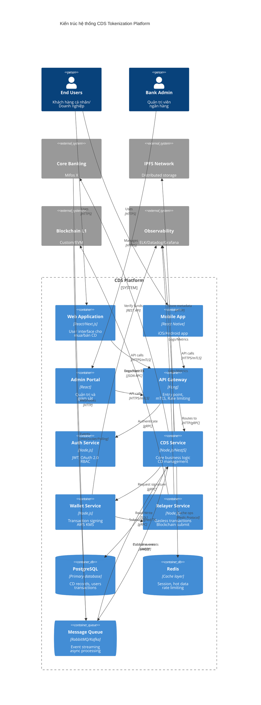
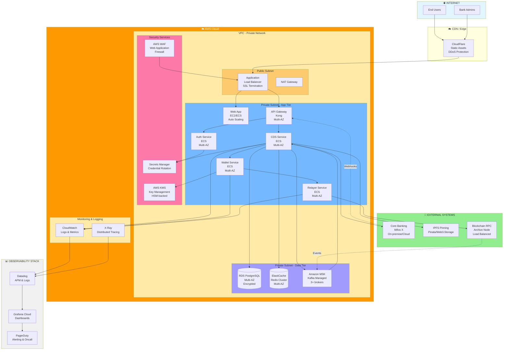
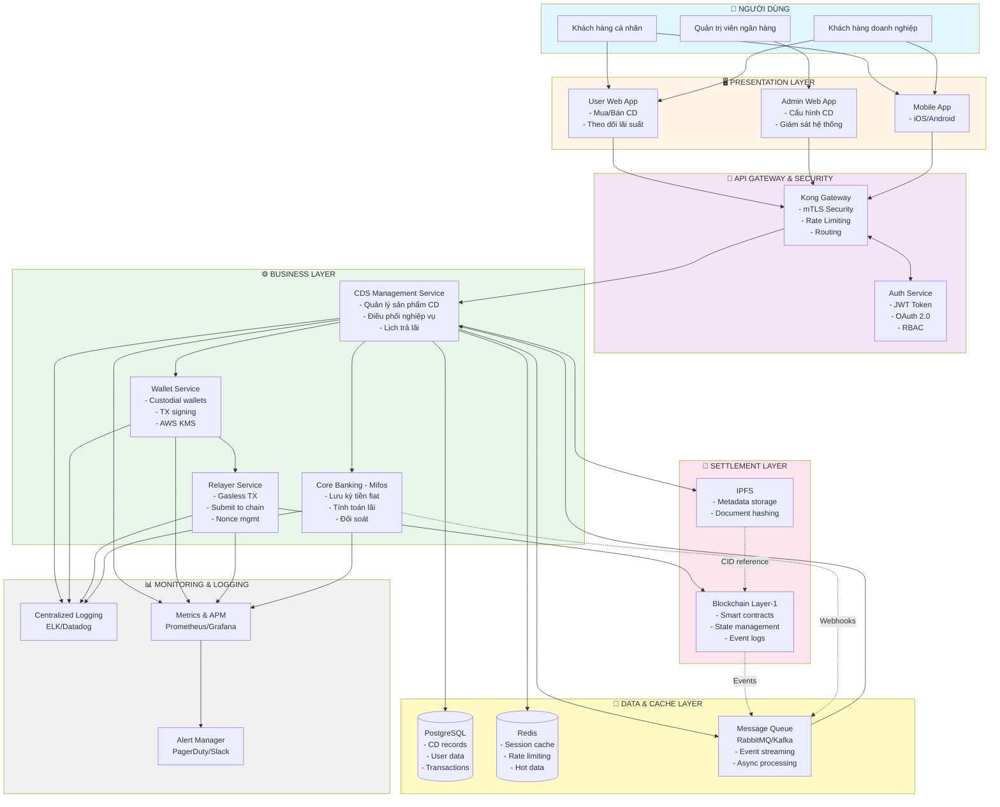
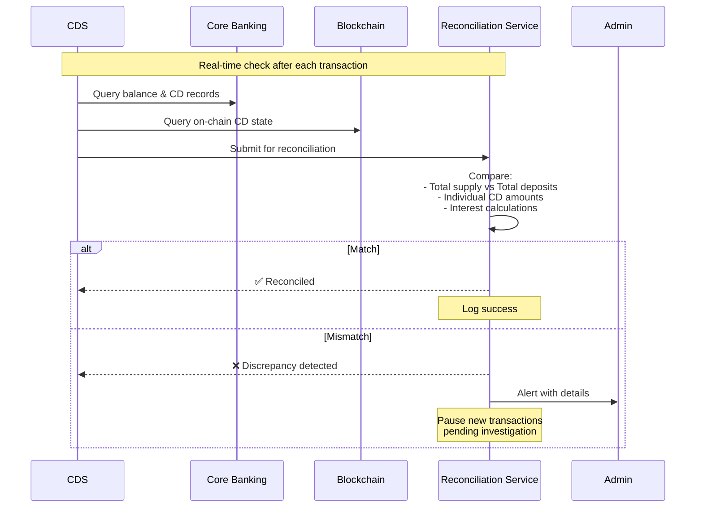
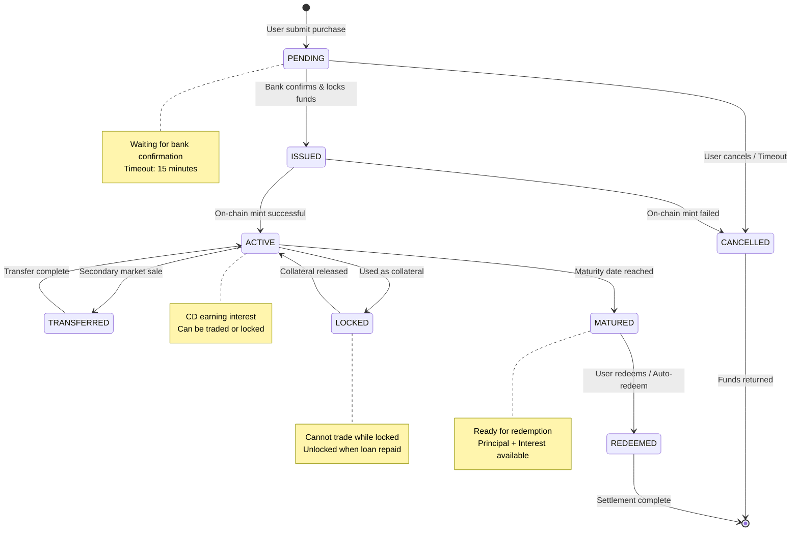

# Architecture and Technical Approach

## Kiến trúc Layer-1 cho Chứng chỉ Tiền gửi được Token hóa

---


## Tổng quan kiến trúc hệ thống

Phần này trình bày kiến trúc hệ thống CDS Tokenization Platform qua 3 góc độ:

1. **Sơ đồ kiến trúc tổng thể (C4 Context)** - Quan điểm high-level về hệ thống, actors và external systems
2. **Sơ đồ Deployment Architecture** - Cách hệ thống được deploy trên cloud infrastructure
3. **Sơ đồ luồng tổng quan (Component Flowchart)** - Chi tiết các components và data flows

---

### Sơ đồ kiến trúc tổng thể (High-level Architecture)


```mermaid
C4Context
    title Kiến trúc hệ thống CDS Tokenization Platform

    Person(user, "End Users", "Khách hàng cá nhân/<br/>Doanh nghiệp")
    Person(admin, "Bank Admin", "Quản trị viên<br/>ngân hàng")

    System_Boundary(platform, "CDS Platform") {
        Container(webapp, "Web Application", "React/Next.js", "User interface cho<br/>mua/bán CD")
        Container(mobile, "Mobile App", "React Native", "iOS/Android app")
        Container(admin_portal, "Admin Portal", "React", "Quản trị và<br/>giám sát")

        Container(gateway, "API Gateway", "Kong", "Entry point,<br/>mTLS, Rate limiting")
        Container(auth, "Auth Service", "Node.js", "JWT, OAuth 2.0<br/>RBAC")

        Container(cds, "CDS Service", "Node.js/NestJS", "Core business logic<br/>CD management")
        Container(wallet, "Wallet Service", "Node.js", "Transaction signing<br/>AWS KMS")
        Container(relayer, "Relayer Service", "Node.js", "Gasless transactions<br/>Blockchain submit")

        ContainerDb(db, "PostgreSQL", "Primary database", "CD records, users<br/>transactions")
        ContainerDb(cache, "Redis", "Cache layer", "Session, hot data<br/>rate limiting")
        ContainerQueue(mq, "Message Queue", "RabbitMQ/Kafka", "Event streaming<br/>async processing")
    }

    System_Ext(mifos, "Core Banking", "Mifos X", "Deposit custody<br/>Interest calculation")
    System_Ext(ipfs, "IPFS Network", "Distributed storage", "CD metadata<br/>Documents")
    System_Ext(blockchain, "Blockchain L1", "Custom/EVM", "Smart contracts<br/>State & Events")

    System_Ext(monitoring, "Observability", "ELK/Datadog/Grafana", "Logs, Metrics<br/>Alerts")

    Rel(user, webapp, "Uses", "HTTPS")
    Rel(user, mobile, "Uses", "HTTPS")
    Rel(admin, admin_portal, "Manages", "HTTPS")

    Rel(webapp, gateway, "API calls", "HTTPS/mTLS")
    Rel(mobile, gateway, "API calls", "HTTPS/mTLS")
    Rel(admin_portal, gateway, "API calls", "HTTPS/mTLS")

    Rel(gateway, auth, "Authenticate", "gRPC")
    Rel(gateway, cds, "Routes to", "HTTP/gRPC")

    Rel(cds, db, "Read/Write", "SQL")
    Rel(cds, cache, "Cache ops", "Redis Protocol")
    Rel(cds, mq, "Publish events", "AMQP")
    Rel(cds, mifos, "Verify funds", "REST API")
    Rel(cds, ipfs, "Store metadata", "HTTP")
    Rel(cds, wallet, "Request signature", "gRPC")

    Rel(wallet, relayer, "Submit signed TX", "gRPC")
    Rel(relayer, blockchain, "Broadcast TX", "JSON-RPC")

    Rel(blockchain, mq, "Events", "WebSocket/Polling")
    Rel(mq, cds, "Consume events", "AMQP")
    Rel(mifos, mq, "Webhooks", "HTTP")

    Rel(cds, monitoring, "Logs/Metrics", "")
    Rel(wallet, monitoring, "Logs/Metrics", "")
    Rel(relayer, monitoring, "Logs/Metrics", "")

    UpdateLayoutConfig($c4ShapeInRow="4", $c4BoundaryInRow="2")
```

---

### Sơ đồ Deployment Architecture


```mermaid
graph TB
    subgraph Internet["🌐 INTERNET"]
        Users[End Users]
        Admins[Bank Admins]
    end

    subgraph CDN["☁️ CDN / Edge"]
        CF[CloudFlare<br/>Static Assets<br/>DDoS Protection]
    end

    subgraph AWS["☁️ AWS Cloud"]
        subgraph VPC["VPC - Private Network"]
            subgraph PublicSubnet["Public Subnet"]
                ALB[Application<br/>Load Balancer<br/>SSL Termination]
                NAT[NAT Gateway]
            end

            subgraph PrivateSubnet1["Private Subnet - App Tier"]
                WebApp[Web App<br/>EC2/ECS<br/>Auto Scaling]
                API1[API Gateway<br/>Kong<br/>Multi-AZ]
                Auth1[Auth Service<br/>ECS<br/>Multi-AZ]
                CDS1[CDS Service<br/>ECS<br/>Multi-AZ]
                Wallet1[Wallet Service<br/>ECS<br/>Multi-AZ]
                Relayer1[Relayer Service<br/>ECS<br/>Multi-AZ]
            end

            subgraph PrivateSubnet2["Private Subnet - Data Tier"]
                RDS[(RDS PostgreSQL<br/>Multi-AZ<br/>Encrypted)]
                ElastiCache[(ElastiCache<br/>Redis Cluster<br/>Multi-AZ)]
                MSK[Amazon MSK<br/>Kafka Managed<br/>3+ brokers]
            end

            subgraph Security["Security Services"]
                KMS[AWS KMS<br/>Key Management<br/>HSM-backed]
                SecretsMgr[Secrets Manager<br/>Credential Rotation]
                WAF[AWS WAF<br/>Web Application<br/>Firewall]
            end
        end

        subgraph Monitoring["Monitoring & Logging"]
            CW[CloudWatch<br/>Logs & Metrics]
            XRay[X-Ray<br/>Distributed Tracing]
        end
    end

    subgraph External["🔗 EXTERNAL SYSTEMS"]
        Mifos[Core Banking<br/>Mifos X<br/>On-premise/Cloud]
        IPFS_Node[IPFS Pinning<br/>Pinata/Web3.Storage]
        Blockchain[Blockchain RPC<br/>Archive Node<br/>Load Balanced]
    end

    subgraph Observability["📊 OBSERVABILITY STACK"]
        Datadog[Datadog<br/>APM & Logs]
        Grafana[Grafana Cloud<br/>Dashboards]
        PagerDuty[PagerDuty<br/>Alerting & Oncall]
    end

    Users --> CF
    Admins --> CF
    CF --> ALB
    ALB --> WebApp
    ALB --> API1

    API1 --> Auth1
    API1 --> CDS1

    CDS1 --> RDS
    CDS1 --> ElastiCache
    CDS1 --> MSK
    CDS1 --> Mifos
    CDS1 --> IPFS_Node
    CDS1 --> Wallet1

    Wallet1 --> KMS
    Wallet1 --> Relayer1
    Relayer1 --> Blockchain

    MSK --> CDS1
    Blockchain -.Events.-> MSK
    Mifos -.Webhooks.-> API1

    Auth1 --> SecretsMgr
    CDS1 --> SecretsMgr
    WAF --> ALB

    CDS1 --> CW
    Wallet1 --> CW
    Relayer1 --> CW
    CW --> Datadog
    XRay --> Datadog

    Datadog --> Grafana
    Grafana --> PagerDuty

    style Internet fill:#e1f5ff
    style AWS fill:#ff9900,color:#fff
    style External fill:#90EE90
    style Observability fill:#f0f0f0
    style VPC fill:#ffeaa7
    style PublicSubnet fill:#fdcb6e
    style PrivateSubnet1 fill:#74b9ff
    style PrivateSubnet2 fill:#a29bfe
    style Security fill:#fd79a8
    style Monitoring fill:#ffeaa7
```

**Đặc điểm Deployment:**

- **Multi-AZ Deployment:** Services được deploy trên nhiều Availability Zones để đảm bảo high availability
- **Auto Scaling:** ECS services tự động scale dựa trên CPU/Memory/Request metrics
- **Security:**
  - Private subnets cho app và data tier
  - KMS cho key management
  - Secrets Manager cho credential rotation
  - WAF cho web protection
- **Networking:**
  - VPC peering hoặc VPN cho kết nối Mifos
  - NAT Gateway cho outbound internet access
  - Internal load balancing giữa services
- **Data Tier:**
  - RDS Multi-AZ với automatic failover
  - Redis cluster với sharding
  - Kafka managed service (MSK) với 3+ brokers
- **Monitoring:**
  - CloudWatch cho AWS-native monitoring
  - X-Ray cho distributed tracing
  - Datadog/Grafana cho centralized observability

---

### Sơ đồ luồng tổng quan (Component Flowchart)


```mermaid
flowchart TB
    subgraph Users["👥 NGƯỜI DÙNG"]
        U1[Khách hàng cá nhân]
        U2[Khách hàng doanh nghiệp]
        U3[Quản trị viên ngân hàng]
    end

    subgraph Presentation["🖥️ PRESENTATION LAYER"]
        WebApp[User Web App<br/>- Mua/Bán CD<br/>- Theo dõi lãi suất]
        AdminApp[Admin Web App<br/>- Cấu hình CD<br/>- Giám sát hệ thống]
        Mobile[Mobile App<br/>- iOS/Android]
    end

    subgraph Gateway["🚪 API GATEWAY & SECURITY"]
        Kong[Kong Gateway<br/>- mTLS Security<br/>- Rate Limiting<br/>- Routing]
        Auth[Auth Service<br/>- JWT Token<br/>- OAuth 2.0<br/>- RBAC]
    end

    subgraph Business["⚙️ BUSINESS LAYER"]
        CDS[CDS Management Service<br/>- Quản lý sản phẩm CD<br/>- Điều phối nghiệp vụ<br/>- Lịch trả lãi]
        Wallet[Wallet Service<br/>- Custodial wallets<br/>- TX signing<br/>- AWS KMS]
        Relayer[Relayer Service<br/>- Gasless TX<br/>- Submit to chain<br/>- Nonce mgmt]
        Mifos[Core Banking - Mifos<br/>- Lưu ký tiền fiat<br/>- Tính toán lãi<br/>- Đối soát]
    end

    subgraph Data["💾 DATA & CACHE LAYER"]
        DB[(PostgreSQL<br/>- CD records<br/>- User data<br/>- Transactions)]
        Cache[(Redis<br/>- Session cache<br/>- Rate limiting<br/>- Hot data)]
        MQ[Message Queue<br/>RabbitMQ/Kafka<br/>- Event streaming<br/>- Async processing]
    end

    subgraph Settlement["🔗 SETTLEMENT LAYER"]
        IPFS[IPFS<br/>- Metadata storage<br/>- Document hashing]
        L1[Blockchain Layer-1<br/>- Smart contracts<br/>- State management<br/>- Event logs]
    end

    subgraph Observability["📊 MONITORING & LOGGING"]
        Logs[Centralized Logging<br/>ELK/Datadog]
        Metrics[Metrics & APM<br/>Prometheus/Grafana]
        Alert[Alert Manager<br/>PagerDuty/Slack]
    end

    %% User flow
    U1 & U2 --> WebApp
    U1 & U2 --> Mobile
    U3 --> AdminApp
    WebApp & AdminApp & Mobile --> Kong

    %% Gateway & Auth
    Kong <--> Auth
    Kong --> CDS

    %% Business logic flow
    CDS --> DB
    CDS --> Cache
    CDS --> MQ
    CDS --> Mifos
    CDS --> IPFS
    CDS --> Wallet

    Wallet --> Relayer
    Relayer --> L1
    IPFS -.CID reference.-> L1

    %% Event-driven architecture
    L1 -.Events.-> MQ
    MQ --> CDS
    Mifos -.Webhooks.-> MQ

    %% Observability
    CDS & Wallet & Relayer & Mifos --> Logs
    CDS & Wallet & Relayer & Mifos --> Metrics
    Metrics --> Alert

    style Users fill:#e1f5ff
    style Presentation fill:#fff4e6
    style Gateway fill:#f3e5f5
    style Business fill:#e8f5e9
    style Data fill:#fff9c4
    style Settlement fill:#fce4ec
    style Observability fill:#f0f0f0
```


### Luồng hoạt động chính

#### 1. Presentation Layer

Người dùng và quản trị viên thao tác qua **User Web App**, **Mobile App** và **Admin Web App**, tất cả request đều đi qua **API Gateway** – điểm truy cập duy nhất.

**User Web App & Mobile App:**
- Đăng ký mua CD
- Theo dõi lãi suất
- Xem lịch trả lãi
- Kiểm tra trạng thái đáo hạn
- Nhận thông báo real-time

**Admin Web App:**
- Cấu hình sản phẩm CD
- Thiết lập kỳ hạn và lãi suất
- Giám sát hệ thống
- Quản lý quy tắc vận hành
- Xem dashboard reconciliation

#### 2. Business Layer

**API Gateway & Security:**
- Entry point duy nhất cho toàn hệ thống
- **Kong Gateway:** Routing, rate limiting, mTLS security
- **Auth Service:** JWT token management, OAuth 2.0, RBAC (Role-Based Access Control)
- Tích hợp với Identity Provider (IdP)

**CDS Management Service:**

Logic nghiệp vụ CD được xử lý tại **CDS Management Service**, tích hợp trực tiếp với **Core Banking Service (Mifos)**.

Chức năng:
- Quản lý sản phẩm CD và CD instances
- Thiết lập lịch trả lãi và đáo hạn
- Điều phối giữa Core Banking, IPFS và Blockchain
- Kích hoạt các hành động on-chain
- Lưu trữ state vào PostgreSQL
- Cache hot data vào Redis
- Publish events vào Message Queue

**Wallet Service + AWS KMS:**
- Custodial wallet management
- Transaction signing under policy control (AWS KMS/HSM)
- Keys never leave secure boundary
- Support EIP-712 typed data signing

**Relayer Service:**
- Chi trả phí giao dịch (gasless UX)
- Thu thập chữ ký và submit lên chain
- Theo dõi trạng thái và retry
- Nonce management để tránh transaction collision

**Core Banking (Mifos):**
- Nguồn dữ liệu tài chính gốc
- Ghi nhận tiền gửi bảo chứng
- Tính toán lãi suất và số tiền đáo hạn
- Xác nhận đối soát trước khi on-chain
- Webhook callbacks cho CDS qua Message Queue

#### 3. Settlement Layer (Tầng thanh toán)

**IPFS (Off-chain Metadata):**

- Metadata CD được lưu off-chain trên **IPFS**:
  - Mệnh giá
  - Lãi suất
  - Kỳ hạn
  - Đơn vị phát hành
  - Hash tài liệu pháp lý

**Blockchain Layer-1 (On-chain State):**

- Trạng thái, vòng đời và logic bất biến được lưu on-chain trên **Layer-1**:
  - Smart contract quản lý CD
  - Vòng đời CD (ISSUED → ACTIVE → MATURED → REDEEMED)
  - Tham chiếu metadata IPFS (CID/hash)
  - Event log phục vụ audit

### Luồng giao dịch end-to-end

```
User Action → Web/Mobile App → Kong Gateway → Auth Service → CDS Management
                                                                    ↓
                                                    ┌───────────────┼────────────┐
                                                    ▼               ▼            ▼
                                               Core Banking      IPFS      Wallet Service
                                               (Verify $)    (Store data)   (Sign TX)
                                                    │               │            │
                                                    └───────────────┼────────────┘
                                                                    ▼
                                                              Relayer Service
                                                              (Pay gas & submit)
                                                                    │
                                                                    ▼
                                                            Blockchain Layer-1
                                                            (Finalize & emit events)
                                                                    │
                                                                    ▼
                                                            Message Queue (MQ)
                                                                    │
                                                                    ▼
                                                            CDS Management
                                                            (Update state)
                                                                    │
                                                                    ▼
                                                               PostgreSQL
                                                               (Persist)
```

### Điểm nổi bật

Giao dịch on-chain được:

- ✅ Ký an toàn thông qua **Wallet Service** sử dụng AWS KMS (custodial),
- ✅ **Relayer Service** chi trả phí giao dịch, giúp người dùng có trải nghiệm gasless,
- ✅ Đảm bảo bảo chứng 1:1 giữa token CD và tiền gửi thực tế trong Core Banking,
- ✅ Minh bạch, có thể audit thông qua event log on-chain,
- ✅ **Event-driven architecture** qua Message Queue cho scalability,
- ✅ **Observability đầy đủ** với logging, metrics và alerting.

---

## Cải tiến so với phiên bản trước

### 🆕 Thành phần bổ sung:

1. **Auth Service** - Tách riêng authentication/authorization khỏi Kong Gateway
2. **Data Layer** - PostgreSQL + Redis + Message Queue cho persistence và caching
3. **Observability Layer** - Centralized logging, metrics, và alerting
4. **Mobile App** - Mở rộng presentation layer cho mobile users

### 🔄 Cải thiện luồng:

**Trước:**
```
User → Kong → CDS → (Mifos/IPFS/Wallet) → Relayer → L1
```

**Sau:**
```
User → Kong → Auth → CDS → (Mifos/IPFS/Wallet) → Relayer → L1
                                    ↓                              ↓
                               PostgreSQL ← MQ ← (Events) ← Blockchain
```

### 🎯 Lợi ích:

- **Scalability**: Event-driven architecture cho phép horizontal scaling
- **Observability**: Full visibility vào system behavior
- **Security**: RBAC và OAuth 2.0 cho fine-grained access control
- **Performance**: Redis caching giảm load lên database và blockchain RPC

---

## Các thành phần chính

### 1️⃣ API Gateway (Kong)

- Entrypoint duy nhất cho toàn hệ thống,
- Định tuyến request đến các service nội bộ,
- Áp dụng mTLS, rate-limit, xác thực và logging,
- Đáp ứng tiêu chuẩn bảo mật cấp doanh nghiệp.

---

### 2️⃣ User Web App & Admin Web App

- **User Web App**: đăng ký mua CD, theo dõi lãi suất, lịch trả lãi và trạng thái đáo hạn.
- **Admin Web App**: cấu hình sản phẩm CD, kỳ hạn, lãi suất, quy tắc vận hành và giám sát hệ thống.

Người dùng không cần hiểu blockchain để sử dụng hệ thống.

---

### 3️⃣ CDS Management Service (Lớp nghiệp vụ trung tâm)

Đây là bộ não điều phối của hệ thống:

- Quản lý sản phẩm CD và từng CD instance,
- Thiết lập lịch trả lãi và đáo hạn,
- Điều phối giữa Core Banking, IPFS và Blockchain,
- Kích hoạt các hành động on-chain thông qua Relayer.

Mọi giao dịch on-chain đều phải phản ánh trạng thái tài chính hợp lệ off-chain.

---

### 4️⃣ Core Banking Integration – Mifos Service

Mifos đóng vai trò nguồn dữ liệu tài chính gốc:

- Ghi nhận tiền gửi bảo chứng cho mỗi CD,
- Tính toán lãi suất và số tiền đáo hạn,
- Xác nhận đối soát trước khi phát hành hoặc tất toán on-chain.

Đảm bảo bảo chứng 1:1 giữa token CD và tiền gửi thực.

#### Quy trình Reconciliation (Đối soát)

**Mục tiêu:** Đảm bảo tính nhất quán giữa on-chain state và off-chain banking records.

**1. Real-time Reconciliation (Mỗi giao dịch):**


```mermaid
sequenceDiagram
    participant CDS
    participant Bank as Core Banking
    participant L1 as Blockchain
    participant Recon as Reconciliation Service

    Note over CDS,Recon: Real-time check after each transaction

    CDS->>Bank: Query balance & CD records
    CDS->>L1: Query on-chain CD state
    CDS->>Recon: Submit for reconciliation

    Recon->>Recon: Compare:<br/>- Total supply vs Total deposits<br/>- Individual CD amounts<br/>- Interest calculations

    alt Match
        Recon-->>CDS: ✅ Reconciled
        Note over Recon: Log success
    else Mismatch
        Recon-->>CDS: ❌ Discrepancy detected
        Recon->>Admin: Alert with details
        Note over Recon: Pause new transactions<br/>pending investigation
    end
```


### 5️⃣ Off-chain Metadata – IPFS

Các thông tin như:

- mệnh giá,
- lãi suất,
- kỳ hạn,
- đơn vị phát hành,
- hash tài liệu pháp lý,

được lưu trữ trên **IPFS**.

Blockchain chỉ lưu CID/hash tham chiếu, đảm bảo dữ liệu bất biến, dễ kiểm toán và tối ưu chi phí on-chain.


### 6️⃣ User Wallet Service – AWS KMS

- Private key được quản lý tập trung và bảo mật bằng **AWS KMS**,
- Không bao giờ lộ ra ngoài hệ thống,
- Ký giao dịch theo chuẩn EIP-712 hoặc raw transaction,
- Phù hợp với tiêu chuẩn bảo mật của tổ chức tài chính.

---

### 7️⃣ Relayer Service – Gasless Transaction

Relayer:

- Chi trả phí giao dịch on-chain,
- Thu thập chữ ký từ Wallet Service,
- Gửi giao dịch lên Layer-1,
- Theo dõi trạng thái và retry khi cần.

Người dùng có trải nghiệm tương đương ứng dụng tài chính truyền thống.

---

### 8️⃣ Blockchain Layer-1

Layer-1 lưu trữ:

- Smart contract quản lý CD,
- Vòng đời CD (state machine - xem chi tiết bên dưới),
- Tham chiếu metadata IPFS,
- Event log phục vụ audit và giám sát.

Blockchain đóng vai trò lớp settlement và kiểm toán minh bạch, không thay thế hệ thống ngân hàng.

#### Vòng đời CD (State Machine)


```mermaid
stateDiagram-v2
    [*] --> PENDING: User submit purchase

    PENDING --> ISSUED: Bank confirms & locks funds
    PENDING --> CANCELLED: User cancels / Timeout

    ISSUED --> ACTIVE: On-chain mint successful
    ISSUED --> CANCELLED: On-chain mint failed

    ACTIVE --> TRANSFERRED: Secondary market sale
    ACTIVE --> LOCKED: Used as collateral
    ACTIVE --> MATURED: Maturity date reached

    TRANSFERRED --> ACTIVE: Transfer complete
    LOCKED --> ACTIVE: Collateral released

    MATURED --> REDEEMED: User redeems / Auto-redeem

    CANCELLED --> [*]: Funds returned
    REDEEMED --> [*]: Settlement complete

    note right of PENDING
        Waiting for bank confirmation
        Timeout: 15 minutes
    end note

    note right of ACTIVE
        CD earning interest
        Can be traded or locked
    end note

    note right of LOCKED
        Cannot trade while locked
        Unlocked when loan repaid
    end note

    note right of MATURED
        Ready for redemption
        Principal + Interest available
    end note
```

**Các trạng thái:**

- **PENDING**: Đơn hàng mới, chờ xác nhận từ Core Banking
- **ISSUED**: Bank đã khóa tiền, chờ mint on-chain
- **ACTIVE**: CD đang hoạt động, tích lũy lãi suất
- **TRANSFERRED**: Đang trong quá trình chuyển nhượng trên secondary market
- **LOCKED**: Đang được sử dụng làm collateral (DeFi)
- **MATURED**: Đã đáo hạn, sẵn sàng tất toán
- **REDEEMED**: Đã tất toán, hoàn tất vòng đời
- **CANCELLED**: Đã hủy (timeout hoặc lỗi)

---

### 9️⃣ Data & Cache Layer

**PostgreSQL Database:**
- Primary data store cho CD records, user profiles, transactions
- ACID compliance cho financial data integrity
- Indexes được tối ưu cho query performance
- Backup & replication cho high availability

**Redis Cache:**
- Session management và user authentication state
- Rate limiting counters
- Hot data caching (active CD list, interest rates)
- Pub/Sub cho real-time notifications
- TTL-based expiry cho temporary data

**Message Queue (RabbitMQ/Kafka):**
- Event streaming giữa các services
- Async processing cho non-critical tasks
- Dead letter queue cho failed messages
- Event replay capability cho debugging
- Decoupling giữa event producers và consumers

---

### 🔟 Observability & Monitoring

**Centralized Logging (ELK/Datadog):**
- Aggregate logs từ tất cả services
- Structured logging với correlation IDs
- Full-text search capability
- Log retention policies

**Metrics & APM (Prometheus/Grafana):**
- Service health metrics (CPU, memory, latency)
- Business metrics (CD issued, total volume, active users)
- Transaction success/failure rates
- Blockchain RPC call latencies
- Database query performance

**Alert Manager:**
- Threshold-based alerts
- Anomaly detection
- On-call rotation integration (PagerDuty)
- Escalation policies
- Incident management workflow

---

## Bảo mật & Tuân thủ

- Validator được kiểm soát (permissioned),
- Smart contract có thể audit,
- Event on-chain phục vụ giám sát và thanh tra,
- Phân tách rõ ràng giữa custody – nghiệp vụ – settlement.

---

## Giá trị cốt lõi của kiến trúc

- Thiết kế riêng cho tài sản tài chính có quản lý
- Thân thiện với ngân hàng và cơ quan quản lý
- Trải nghiệm người dùng đơn giản, không cần gas
-  Phân tách on-chain / off-chain rõ ràng

---

## Tổng kết

Chúng tôi xây dựng một Layer-1 ưu tiên tuân thủ, cho phép token hóa chứng chỉ tiền gửi trong khi ngân hàng vẫn kiểm soát dòng tiền, người dùng không cần trả gas và toàn bộ vòng đời được kiểm toán minh bạch trên blockchain.
